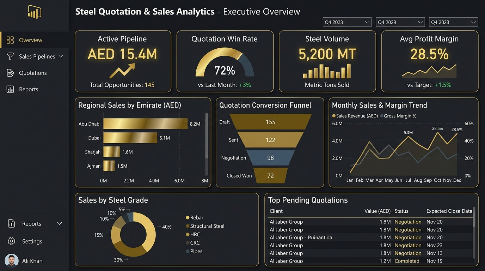
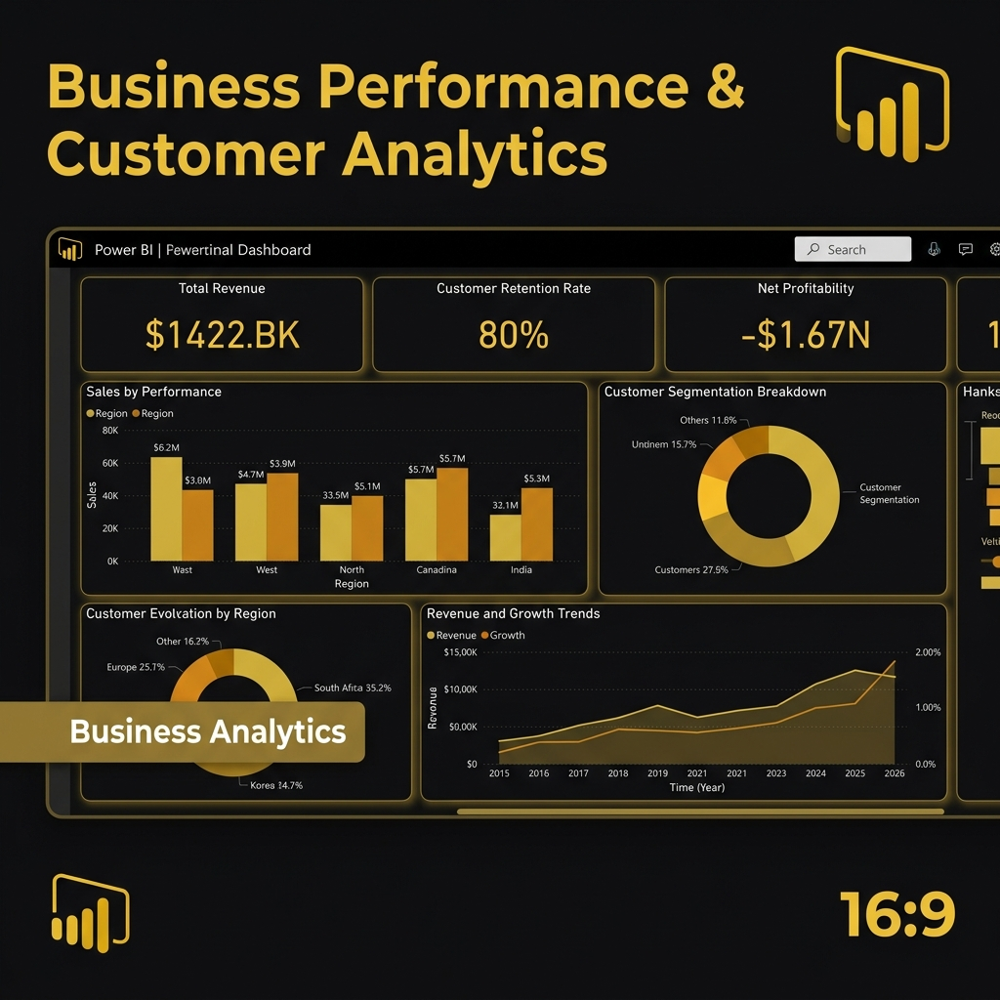
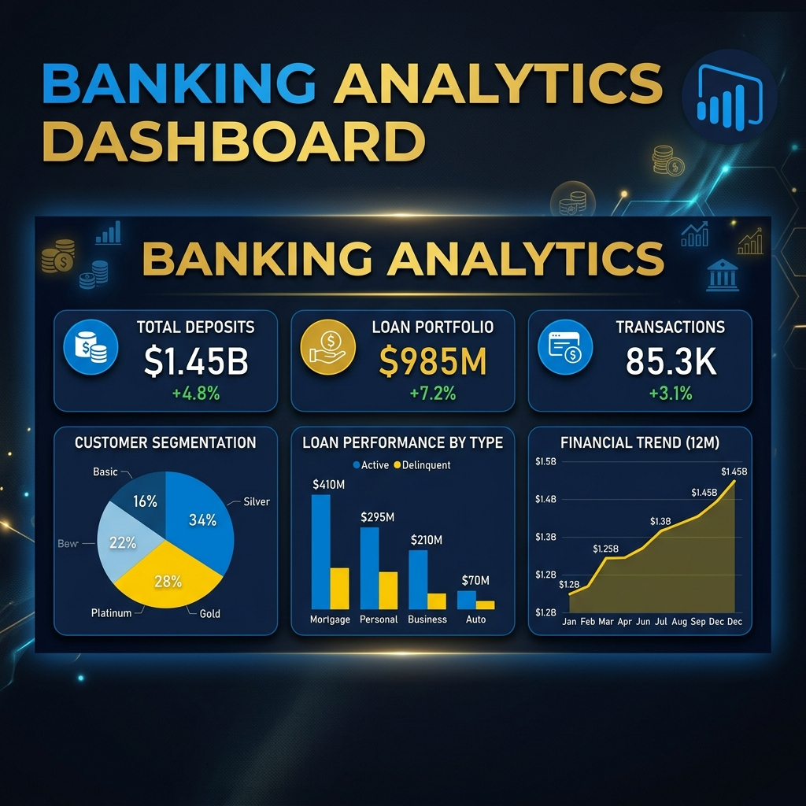

<div align="center">

  # 📊 Karthick Raja
  ### **Data Analyst & Power BI Developer**

  *Transforming Complex Datasets into Interactive Dashboards & Actionable Business Insights*

  📍 **Dubai, UAE** *(UAE Visit Visa, Available Immediately)* | 🎓 **B.E. Computer Science & Engineering**

  [](https://karthickraja.page/)
  [](https://www.linkedin.com/in/karthick-raja-l-7a5b3a26b/)
  [](https://github.com/KarthickRaja46)
  [](mailto:karthickraja232205@gmail.com)

  ---

  ### 🛠️ Core Tech Stack
  
  
  
  
  
  
  
  
  

</div>

---

## 👨‍💻 About Me

**Data Analyst & Power BI Developer** with 1.5+ years of experience in **SQL, Power BI, DAX, Power Query, Azure, Excel, and data modeling**. Experienced in building KPI dashboards, executive reports, and automated BI solutions across **sales, banking, and supply chain datasets**. Tracked **AED 15M+ in commercial opportunities**, **reduced reporting turnaround time by 70%**, and **eliminated 12+ hours of weekly manual reporting**. Based in **Dubai, UAE** (UAE Visit Visa, available immediately).

- 💼 **Current Status:** Open to Full-Time Data Analyst & Power BI Developer roles
- 🎯 **Core Specialization:** Power BI Desktop & Service, DAX, Star Schema Modeling, SQL (MySQL, PostgreSQL, T-SQL), Power Query (M), Power BI Gateway, Advanced Excel, Python (Pandas, NumPy, EDA)
- 🌐 **Live Portfolio:** [https://karthickraja.page](https://karthickraja.page)

---

## 📈 Key Highlights & Verified Metrics

| Metric | Detail |
| :--- | :--- |
| 💼 **Experience** | **1.5+ Years** Hands-on Data Analyst & Power BI Developer Experience |
| 📊 **Dashboards & Solutions** | **8+** Interactive Multi-Page BI Dashboards & Analytical Solutions |
| 🔍 **Data Analyzed** | **800,000+** Data Records Cleaned, Validated & Processed |
| ⚡ **Reporting Efficiency** | **70%** Reduction in Reporting Turnaround Time (12+ hours saved weekly) |
| 📜 **Certifications** | **6+** Industry Credentials (Microsoft, Google, IBM) |

---

## 🚀 Projects

### 1. Steel Quotation & Sales Analytics Dashboard
> **Technologies:** Power BI, DAX, SQL, Power Query, Star Schema

Designed an executive-level 5-page Power BI dashboard providing commercial leadership with visibility into **AED 15M+ in active opportunities** across UAE emirates, saving **12+ hours/week** in manual reporting overhead and improving sales conversion by **15%**.



#### 🌟 Key Features & Business Value:
- **5-Page Commercial Architecture:** Executive KPI Summary, Quotation Funnel, Regional Demand, Win/Loss Analysis, and Margin Diagnostics.
- **Workflow Automation:** Replaced manual Excel compilations with automated Power Query ETL pipelines, cutting turnaround time by 70%.
- **Advanced DAX Metrics:** 30+ dynamic measures for quotation aging, YoY growth, conversion rates, and regional volume distributions.
- **Governance & Security:** Implemented Row-Level Security (RLS) for role-specific UAE branch access.

🔗 **[Live Power BI Dashboard](https://app.powerbi.com/view?r=eyJrIjoiMWQxMzFjYTAtZjkxMi00YzViLTg2NTktMGI5Y2YzNWRkNDBkIiwidCI6IjNjYjM3ODQ0LTAxZGEtNGJlYS04MDEwLTBmYjFmNWExZWM0ZSJ9)** | 💻 **[GitHub Profile](https://github.com/KarthickRaja46)**

---

### 2. Business Performance & Customer Analytics Dashboard
> **Technologies:** Power BI, DAX, Star Schema, Azure, KPI Analytics

Analyzed **$2.3M in revenue** and **$286K in profit** across **9,994 orders**, identifying customer retention patterns, cohort metrics, and YTD performance trends.



#### 🌟 Key Features & Business Value:
- **Customer Segmentation & Cohorts:** Evaluated customer lifetime value (LTV), cohort retention patterns, and churn risk factors.
- **Advanced DAX Measures:** Dynamic measures for YoY growth, profit margins, and executive KPI benchmarking.
- **Interactive Drill-Through:** Multi-level slicers and tooltip cards enabling root-cause analysis for executive reporting.

🔗 **[Live Power BI Dashboard](https://app.powerbi.com/view?r=eyJrIjoiNjRlMTgyYmYtYjBjOC00ZGUzLTlmMjMtYzY3NTBiMDcyMGZiIiwidCI6IjNjYjM3ODQ0LTAxZGEtNGJlYS04MDEwLTBmYjFmNWExZWM0ZSJ9)** | 💻 **[GitHub Profile](https://github.com/KarthickRaja46)**

---

### 3. Banking Performance Dashboard
> **Technologies:** Power BI, SQL (MySQL), Power Query, Financial Analytics, DAX

Analyzed **₹4.87B in transaction value** across **150,000+ records**, identifying high-failure transaction segments and risk factors with SQL validation and Power Query ETL, enabling a **25% reduction in high-failure segments**.



#### 🌟 Key Features & Business Value:
- **Financial KPIs:** Real-time monitoring of transaction volumes, failure rates, loan defaults, and liquidity metrics.
- **Data Transformation & QA:** Used SQL CTEs, window functions, and Power Query to clean and validate 150K+ transactional records.
- **Risk Segmentation:** Dynamic views enabling deep dives into high-failure transaction segments and abnormal patterns.

🔗 **[Live Power BI Dashboard](https://app.powerbi.com/view?r=eyJrIjoiMjg1MTcwZjktZTViMy00OTU3LTgyMTctNGIzNTRhNWYwYWM1IiwidCI6IjNjYjM3ODQ0LTAxZGEtNGJlYS04MDEwLTBmYjFmNWExZWM0ZSJ9)** | 💻 **[GitHub Profile](https://github.com/KarthickRaja46)**

---

### 4. VOLT IQ – Industrial IoT Machine Intelligence Platform
> **Technologies:** Power BI, DAX, IoT Analytics, Anomaly Detection, Power Query

Analyzed **50,000+ IoT telemetry records** across 10 industrial machines to monitor equipment health, evaluate downtime risk, and detect vibration anomalies in real-time.


#### 🌟 Key Features & Business Value:
- **Equipment Health Monitoring:** Real-time tracking of vibration, temperature, and operating pressure telemetry.
- **Downtime Risk Identification:** Early indicator alerts to identify machine downtime risk before failure occurs using MTBF benchmarks.
- **Operational Diagnostics:** Machine utilization benchmarks and maintenance scheduling views.

🔗 **[Live Power BI Dashboard](https://app.powerbi.com/view?r=eyJrIjoiZTNjNzZiNGItYjM3Zi00NDNjLWFhODMtNjNiZjlkMWI4NjQ4IiwidCI6IjNjYjM3ODQ0LTAxZGEtNGJlYS04MDEwLTBmYjFmNWExZWM0ZSJ9&pageName=fd208009e45a735db3b9)** | 💻 **[GitHub Profile](https://github.com/KarthickRaja46)**

---

## 📂 Additional Projects & Solutions

| Project | Domain / Type | Key Technologies | Description & Impact |
| :--- | :--- | :--- | :--- |
| **ClaimVision** | Healthcare Analytics *(Simulated)* | Power BI, DAX, SQL | Modeled 120,000+ insurance claims across a 4-page dashboard with 25+ DAX measures evaluating claim denial rates and reimbursement cycles. |
| **API Performance Monitoring** | Web Infrastructure *(Simulated)* | Python, SQL, Power BI | Analyzed 100,000+ simulated API request logs to benchmark latency percentiles (p95/p99), throughput, error rates, and SLA adherence. |
| **Retail & Supply Chain Suite** | Enterprise Operations | Power BI, SQL, Gateway | Cleaned and validated 500K+ transaction records, tracking customer churn indicators, delivery lead times, and fulfillment bottlenecks. |
| **ATS Resume Analyzer** | NLP Automation | Python, Text Analytics | Developed a Python tool parsing candidate resumes against job descriptions to extract keywords and calculate semantic match scores. |

---

## 🛠️ Technical Skills Matrix

| Proficiency Level | Skills & Technologies |
| :--- | :--- |
| **Advanced** | Power BI Desktop & Service, DAX (Complex Measures & Time Intelligence), SQL (MySQL, PostgreSQL, T-SQL), Star Schema & Semantic Data Modeling, Data Visualization & KPI Design |
| **Strong** | Power Query (M Code), Advanced Excel (Power Pivot, XLOOKUP, Modeling), Data Validation & QA, Power BI Gateway & Scheduled Refreshes, Row-Level Security (RLS) |
| **Working Knowledge** | Python (Pandas, NumPy, EDA), Microsoft Azure (Data Fundamentals), Microsoft Fabric, Power Automate, API Data Extraction |

---

## 📜 Professional Certifications

1. 🏆 **Microsoft Certified: Power BI Data Analyst** — Microsoft *(Credential ID: TYPPUPQXZ0T8)*
2. 🏆 **Google Business Intelligence** — Google *(Professional Certificate)*
3. 🏆 **Microsoft Azure Fundamentals (AZ-900)** — Microsoft *(Cloud & Data Infrastructure)*
4. 🏆 **Generative AI for Data Analysts** — IBM *(Credential ID: Q5AF9GPDM2LU)*
5. 🏆 **Harnessing the Power of Data with Power BI** — Microsoft *(Credential ID: FHTK7PQTG40Z)*
6. 🏆 **Career Essentials in Data Analysis** — Microsoft & LinkedIn

*All credentials can be verified directly on [LinkedIn Certifications](https://www.linkedin.com/in/karthick-raja-l-7a5b3a26b/details/certifications/).*

---

## 💼 Work Experience

### **Besant Technologies** — *Chennai, India*
**Data Analyst Intern** | **Jan 2026 – Jul 2026**
- Built end-to-end BI reporting solutions across Retail, Banking, and Supply Chain datasets, covering data extraction, cleansing, validation, analysis, and Power BI reporting.
- Used SQL with CTEs, joins, window functions, and aggregations to clean, validate, and standardize 500K+ transactional records, improving data accuracy and consistency across reports.
- Configured scheduled data refresh automation through Power BI Gateway, reducing reporting delays by 35% and improving reporting turnaround.
- Conducted Exploratory Data Analysis (EDA) using SQL and Python (Pandas) to identify sales trends, customer churn indicators, and fulfillment bottlenecks.

### **Enjay Engineering Services** — *Dubai, UAE (Remote)*
**Power BI Developer (Freelance)** | **May 2025 – Nov 2025**
- Collaborated with business stakeholders to define reporting requirements, commercial KPIs, and executive dashboard layouts.
- Designed and maintained Power BI dashboards delivering executive and project-level KPI reporting for engineering quotation and commercial pipeline performance, giving regional leadership visibility into AED 15M+ in active opportunities across UAE emirates.
- Built Star Schema data models and 30+ DAX measures covering time intelligence, YoY growth, conversion rates, and quotation aging to support engineering project performance reporting and management reviews.
- Automated the weekly quotation reporting workflow using Power Query, eliminating 12+ hours of manual reporting effort per week and reducing reporting turnaround time by 70%.
- Analyzed regional product demand, steel grades, volumes, pricing, and margins to identify margin leakage, improving sales conversion by 15% through emirate-level opportunity tracking.
- Implemented Row-Level Security (RLS) to provide role-specific branch-level access for regional sales managers, strengthening data security and reporting governance.

---

## 🎓 Education

**Bachelor of Engineering (B.E.) — Computer Science & Engineering**  
*Hindusthan Institute of Technology, Coimbatore, India* | **2022 – 2026**  
*Focus: Business Intelligence & Data Engineering | Medium of Instruction: English*

---

## 💻 Local Setup

To run this portfolio website locally on your computer:

```bash
# 1. Clone this repository
git clone https://github.com/KarthickRaja46/Portfolio-KarthickRaja.git

# 2. Navigate to the project directory
cd Portfolio-KarthickRaja

# 3. Install dependencies (Node.js 20+)
npm install

# 4. Start the dev server at http://localhost:5173
npm run dev

# 5. Build for production (outputs to dist/)
npm run build
```

Built with **React + Vite** and **Motion** for animation. All portfolio copy (experience, projects, skills, certifications, contact details) lives in [`src/data/content.js`](src/data/content.js) — edit that file to update the site. Static files (resume PDF, images, `sitemap.xml`, `robots.txt`, `CNAME`) live in `public/`.

---

## 📬 Contact & Connect

- 🌐 **Portfolio Website:** [https://karthickraja.page](https://karthickraja.page)
- 💼 **LinkedIn:** [Karthick Raja](https://www.linkedin.com/in/karthick-raja-l-7a5b3a26b/)
- 🐙 **GitHub:** [KarthickRaja46](https://github.com/KarthickRaja46)
- ✉️ **Email:** [karthickraja232205@gmail.com](mailto:karthickraja232205@gmail.com)
- 📱 **Phone / WhatsApp:** [+971 50 256 7444](https://wa.me/971502567444)
- 📍 **Location:** Dubai, United Arab Emirates *(UAE Visit Visa, Available Immediately)*

<div align="center">
  <br/>
  <i>© 2026 Karthick Raja. Built with passion for data analytics and business intelligence.</i>
</div>