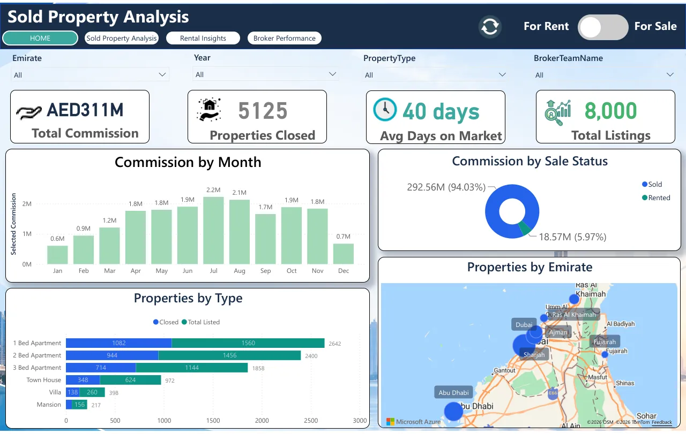

<div align="center">

  # 📊 Karthick Raja
  ### **Data Analyst & Power BI Developer**

  *Transforming Complex Datasets into Interactive Dashboards & Actionable Business Insights*

  📍 **Dubai, UAE** *(Available Immediately)* | 🎓 **B.E. Computer Science & Engineering**

  [](https://karthickraja.page/)
  [](https://www.linkedin.com/in/karthick-raja-l-7a5b3a26b/)
  [](https://github.com/KarthickRaja46)
  [](mailto:karthickrajacareer46@gmail.com)

  ---

  ### 🛠️ Core Tech Stack
  
  
  
  
  
  
  
  
  

</div>

---

## 👨‍💻 About Me

**Data Analyst & Power BI Developer** with 1.5+ years of hands-on experience in **SQL, Power BI, DAX, Power Query, Excel, and data modeling**. Experienced in building KPI dashboards, executive reports, and automated BI solutions across **sales, banking, and supply chain datasets**. Tracked **AED 15M+ in commercial opportunities**, **reduced reporting turnaround time by 70%**, and **eliminated 12+ hours of weekly manual reporting**. Based in **Dubai, UAE** (available immediately).

- 💼 **Current Status:** Open to Full-Time Data Analyst & Power BI Developer roles
- 🎯 **Core Specialization:** Power BI Desktop & Service, DAX, Star Schema Modeling, SQL (MySQL, PostgreSQL, T-SQL), Power Query (M), Power BI Gateway, Advanced Excel, Python (Pandas, NumPy, EDA)
- 🌐 **Live Portfolio:** [https://karthickraja.page](https://karthickraja.page)

---

## 📈 Key Highlights

| Metric | Detail |
| :--- | :--- |
| 💼 **Experience** | **1.5+ years** hands-on as a Data Analyst intern and freelance Power BI Developer |
| 📊 **Live BI projects** | **8** interactive Power BI reports, each with a PDF export |
| 🔍 **Data Analyzed** | **800,000+** records cleaned, validated and modeled |
| ⚡ **Reporting Efficiency** | **70%** faster reporting turnaround at Enjay (12+ hours saved weekly) |
| 📜 **Credentials** | **2** Microsoft certifications + **4** course certificates |

---

## 🚀 Projects

| Project | Domain | What it covers | Links |
| :--- | :--- | :--- | :--- |
| **UAE Real Estate Analytics** | Real Estate · UAE | 8,000 listings across all seven emirates: AED 3bn in sales, AED 311M commission, rental occupancy and an 18-brokerage leaderboard. | [Live](https://app.powerbi.com/view?r=eyJrIjoiYWI1YjViZTQtNTg3Zi00MmYwLThkMDAtYmY0YTFjNzU4MzEyIiwidCI6IjNjYjM3ODQ0LTAxZGEtNGJlYS04MDEwLTBmYjFmNWExZWM0ZSJ9) · [GitHub](https://github.com/KarthickRaja46/UAE-Real-Estate-Analytics-PowerBI) · [PDF](public/assets/projects/uae-real-estate.pdf) |
| **Banking Performance Dashboard** | Financial Analytics | ₹4.87B in transaction value across 150K transactions, with fee and tax tracking, state-wise revenue and failed-transaction analysis. | [Live](https://app.powerbi.com/view?r=eyJrIjoiM2E0ZTNiMTEtYWMwNS00NWE4LWE2ODMtZDhlZmYwYzdjNzE2IiwidCI6IjNjYjM3ODQ0LTAxZGEtNGJlYS04MDEwLTBmYjFmNWExZWM0ZSJ9) · [GitHub](https://github.com/KarthickRaja46/Banking-Performance-Analytics) · [PDF](public/assets/projects/banking-performance.pdf) |
| **VOLT IQ – Industrial IoT Platform** | Industrial IoT | 100K+ sensor readings from 50 machines: anomaly detection, predictive maintenance, energy and data-quality monitoring. | [Live](https://app.powerbi.com/view?r=eyJrIjoiMjI0MDdhOTYtMmJmZi00YjM5LWIwZGQtZGIyNjhhOWZmZTFkIiwidCI6IjNjYjM3ODQ0LTAxZGEtNGJlYS04MDEwLTBmYjFmNWExZWM0ZSJ9) · [GitHub](https://github.com/KarthickRaja46/VOLT-IQ-Industrial-IoT-Analytics) · [PDF](public/assets/projects/volt-iq.pdf) |
| **Business Performance & Customer Analytics** | Subscription & Revenue | 7.77M revenue, 92.3% collection rate, 421K MRR and 7.97% churn by segment, industry and usage. | [Live](https://app.powerbi.com/view?r=eyJrIjoiMWI4YjFjODQtOTBkOS00ZmM2LWI0NTgtNmM0NmQ1ZTAxYWFiIiwidCI6IjNjYjM3ODQ0LTAxZGEtNGJlYS04MDEwLTBmYjFmNWExZWM0ZSJ9) · [GitHub](https://github.com/KarthickRaja46/Business-Performance-Customer-Intelligence) · [PDF](public/assets/projects/business-performance.pdf) |
| **ClaimVision – Healthcare Claims Analytics** | Healthcare | 20K claims across 1,000 providers, with demographics, provider efficiency and 5,011 high-fraud-risk claims flagged. | [Live](https://app.powerbi.com/view?r=eyJrIjoiMWQxMzFjYTAtZjkxMi00YzViLTg2NTktMGI5Y2YzNWRkNDBkIiwidCI6IjNjYjM3ODQ0LTAxZGEtNGJlYS04MDEwLTBmYjFmNWExZWM0ZSJ9) · [GitHub](https://github.com/KarthickRaja46/ClaimVision-Healthcare-Analytics) · [PDF](public/assets/projects/claimvision.pdf) |
| **API Performance Monitoring System** | API Monitoring · Python | 559K API requests across 11 endpoints: SLA breaches, latency bottlenecks and a system health score, fed by a Python + MySQL ETL. | [Live](https://app.powerbi.com/view?r=eyJrIjoiZmNmMzFhZTAtYWZiZS00OWQyLWEyMDgtYjllNTJkM2FmMTgzIiwidCI6IjNjYjM3ODQ0LTAxZGEtNGJlYS04MDEwLTBmYjFmNWExZWM0ZSJ9) · [GitHub](https://github.com/KarthickRaja46/API-Performance-Monitoring-Analytics) · [PDF](public/assets/projects/api-monitoring.pdf) |
| **Retail Analytics & Profit Insights** | Retail | $798K sales and $78K profit (9.8% margin), 2014–2017, by category, city and sales manager. | [Live](https://app.powerbi.com/view?r=eyJrIjoiZWRiMTkxYTYtOGRhZS00NTRiLTg4MTgtMGI4MjcyMDhiMjgzIiwidCI6IjNjYjM3ODQ0LTAxZGEtNGJlYS04MDEwLTBmYjFmNWExZWM0ZSJ9) · [GitHub](https://github.com/KarthickRaja46/Retail-Analytics-Profit-Insights) · [PDF](public/assets/projects/retail-profit.pdf) |
| **Loan Analytics & Risk Management** | Lending & Risk | 20K loan applications worth 498M by credit score, employment, education and purpose, flagging high-risk applicants. | [Live](https://app.powerbi.com/view?r=eyJrIjoiMzkxYzQ5ZGUtYTQ2ZC00MWFlLWIxNzAtOWZlMDU0MjMzMzFlIiwidCI6IjNjYjM3ODQ0LTAxZGEtNGJlYS04MDEwLTBmYjFmNWExZWM0ZSJ9) · [PDF](public/assets/projects/loan-risk.pdf) |



---

## 🛠️ Technical Skills Matrix

| Proficiency Level | Skills & Technologies |
| :--- | :--- |
| **Advanced** | Power BI Desktop & Service, DAX (Complex Measures & Time Intelligence), SQL (MySQL, PostgreSQL, T-SQL), Star Schema & Semantic Data Modeling, Data Visualization & KPI Design |
| **Strong** | Power Query (M Code), Advanced Excel (Power Pivot, XLOOKUP, Modeling), Data Validation & QA, Power BI Gateway & Scheduled Refreshes, Row-Level Security (RLS) |
| **Working Knowledge** | Python (Pandas, NumPy, EDA), Microsoft Azure (Data Fundamentals), Microsoft Fabric, Power Automate, API Data Extraction |

---

## 📜 Certifications & Courses

1. 🏆 **Microsoft Certified: Power BI Data Analyst Associate** — Microsoft *(Credential ID: TYPPUPQXZ0T8)*
2. 🏆 **Microsoft Certified: Azure Fundamentals** — Microsoft
3. 📘 **Google Business Intelligence** — Professional Certificate, Coursera
4. 📘 **Generative AI for Data Analysts** — IBM Specialization, Coursera *(Credential ID: Q5AF9GPDM2LU)*
5. 📘 **Harnessing the Power of Data with Power BI** — Microsoft course certificate, Coursera *(Credential ID: FHTK7PQTG40Z)*
6. 📘 **Career Essentials in Data Analysis** — Microsoft & LinkedIn, LinkedIn Learning

*All credentials can be verified directly on [LinkedIn Certifications](https://www.linkedin.com/in/karthick-raja-l-7a5b3a26b/details/certifications/).*

---

## 💼 Work Experience

### **Besant Technologies** — *Chennai, India*
**Data Analyst Intern** | **Jan 2026 – Jul 2026**
- Built end-to-end BI reporting solutions across Retail, Banking, and Supply Chain datasets, covering data extraction, cleansing, validation, analysis, and Power BI reporting.
- Used SQL with CTEs, joins, window functions, and aggregations to clean, validate, and standardize 500K+ transactional records, improving data accuracy and consistency across reports.
- Configured scheduled data refresh automation through Power BI Gateway, reducing reporting delays by 35% and improving reporting turnaround.
- Conducted Exploratory Data Analysis (EDA) using SQL and Python (Pandas) to identify sales trends, customer churn indicators, and fulfillment bottlenecks.

### **Enjay Engineering Services** — *Dubai, UAE (Remote)*
**Power BI Developer (Freelance)** | **May 2025 – Nov 2025**
- Collaborated with business stakeholders to define reporting requirements, commercial KPIs, and executive dashboard layouts.
- Designed and maintained Power BI dashboards delivering executive and project-level KPI reporting for engineering quotation and commercial pipeline performance, giving regional leadership visibility into AED 15M+ in active opportunities across UAE emirates.
- Built Star Schema data models and 30+ DAX measures covering time intelligence, YoY growth, conversion rates, and quotation aging to support engineering project performance reporting and management reviews.
- Automated the weekly quotation reporting workflow using Power Query, eliminating 12+ hours of manual reporting effort per week and reducing reporting turnaround time by 70%.
- Analyzed regional product demand, steel grades, volumes, pricing, and margins to identify margin leakage, improving sales conversion by 15% through emirate-level opportunity tracking.
- Implemented Row-Level Security (RLS) to provide role-specific branch-level access for regional sales managers, strengthening data security and reporting governance.

---

## 🎓 Education

**Bachelor of Engineering (B.E.) — Computer Science & Engineering**  
*Hindusthan Institute of Technology, Coimbatore, India* | **2022 – 2026**  
*Medium of Instruction: English*

---

## 💻 Local Setup

To run this portfolio website locally on your computer:

```bash
# 1. Clone this repository
git clone https://github.com/KarthickRaja46/Portfolio-KarthickRaja.git

# 2. Navigate to the project directory
cd Portfolio-KarthickRaja

# 3. Install dependencies (Node.js 20+)
npm install

# 4. Start the dev server at http://localhost:5173
npm run dev

# 5. Build for production (outputs to dist/)
npm run build
```

Built with **React + Vite**, **Motion** for animation and **Lenis** for smooth scrolling. All portfolio copy (experience, projects, skills, certifications) lives in [`src/data/content.js`](src/data/content.js), and contact details in [`src/data/profile.js`](src/data/profile.js) — edit those files to update the site. Static files (resume PDF, project thumbnails and PDFs, icons, `sitemap.xml`, `robots.txt`) live in `public/`.

**Contact form:** set `VITE_WEB3FORMS_KEY` (a free key from [web3forms.com](https://web3forms.com)) in Vercel → Project → Settings → Environment Variables, then redeploy. Without it, the form falls back to opening the visitor's email app.

---

## 📬 Contact & Connect

- 🌐 **Portfolio Website:** [https://karthickraja.page](https://karthickraja.page)
- 💼 **LinkedIn:** [Karthick Raja](https://www.linkedin.com/in/karthick-raja-l-7a5b3a26b/)
- 🐙 **GitHub:** [KarthickRaja46](https://github.com/KarthickRaja46)
- 💼 **Career Email:** [karthickrajacareer46@gmail.com](mailto:karthickrajacareer46@gmail.com)
- ✉️ **Personal Email:** [karthickraja232205@gmail.com](mailto:karthickraja232205@gmail.com)
- 📱 **Phone / WhatsApp:** [+971 50 256 7444](https://wa.me/971502567444)
- 📍 **Location:** Dubai, United Arab Emirates *(Available Immediately)*

<div align="center">
  <br/>
  <i>© 2026 Karthick Raja. Built with passion for data analytics and business intelligence.</i>
</div>